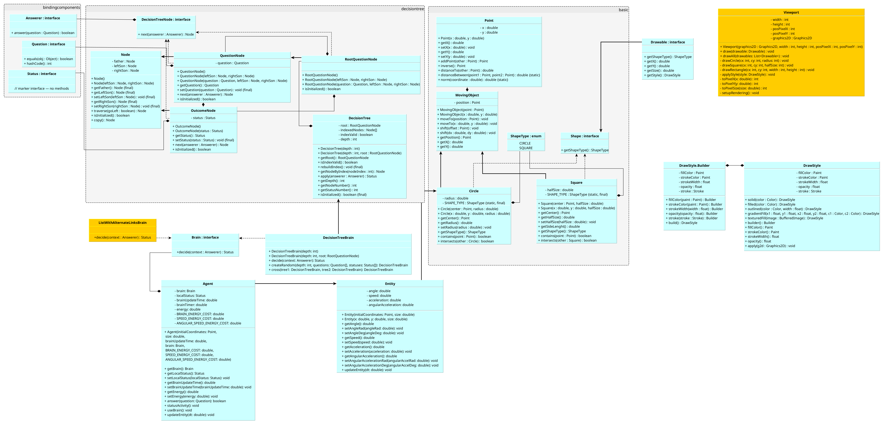

# evolution-simulator
## UML diagram


## Decision Tree Module

This [module](src/main/java/org/jinseisieko/evolution/decisiontree) provides a flexible and extensible implementation of **binary decision trees** designed for use in evolutionary simulations and agent-based systems. The core idea is to separate **tree structure** from **decision logic**, enabling trees to be evolved, mutated, serialized, or evaluated in diverse contexts.

---

### Key Concepts

#### 1. **Tree Structure**
- The tree is binary: each internal node has exactly two children (left for `false`, right for `true`).
- **Internal nodes** (`QuestionNode`, `RootQuestionNode`) hold a `Question`.
- **Leaf nodes** (`OutcomeNode`) hold a final `Status` result.
- The root node (`RootQuestionNode`) is a special `QuestionNode` that does not require a parent.

#### 2. **Decoupled Evaluation via `Answerer`**
- Questions are **not evaluated by the tree itself**.
- Instead, an external `Answerer` object provides boolean answers to questions.
- This allows the same tree to be evaluated:
  - Against different agents (e.g., using their sensory state),
  - In test environments (with mock answers),
  - Or as part of evolutionary strategies (with fixed or randomized responses).

#### 3. **Node Indexing**
- Nodes can be indexed using a **1-based level-order numbering scheme**:
  - Root = 1
  - Left child of node *i* = `2*i`
  - Right child of node *i* = `2*i + 1`
- The `DecisionTree` class supports fast O(1) node lookup via `getNodeByIndex(int)` after calling `rebuildIndex()`.
- Indexing is essential for efficient **mutation**, **crossover**, and **serialization** in evolutionary algorithms.

#### 4. **Extensibility & Safety**
- All core components (`Question`, `Status`, `Answerer`) are **interfaces**, enabling custom implementations.
- Nodes maintain **bidirectional parent-child links** with automatic consistency.
- Comprehensive validation (e.g., non-null checks, initialization states) prevents malformed trees.
- The design assumes **immutable `Question` and `Status` implementations** for safe caching and comparison.

---
### UML Class Diagram

### Core Classes & Interfaces

| Component | Role |
|----------|------|
| `DecisionTree` | Entry point; manages root, indexing, and tree execution (`apply(Answerer)`). |
| `Answerer` | Strategy interface for answering questions during traversal. |
| `Question` | Represents a yes/no condition; evaluated externally by an `Answerer`. |
| `Status` | Marker interface for leaf outcomes (e.g., actions, decisions, results). |
| `Node` | Base structural node with parent/child links. |
| `DecisionTreeNode` | Defines traversal logic via `next(Answerer)`. |
| `QuestionNode` `RootQuestionNode` | Internal nodes that route traversal based on answers. |
| `OutcomeNode` | Leaf nodes that terminate traversal and return a `Status`. |

---

### Usage Example

```java
// 1. Define a question
record EnergyHigh() implements Question {
    @Override public boolean equals(Object o) { /* ... */ }
    @Override public int hashCode() { return 1; }
}

// 2. Define a status
record MoveForward() implements Status {}

// 3. Build a tree
DecisionTree tree = new DecisionTree(2); // depth = 2 → 3 levels
tree.rebuildIndex();

// Assign questions and outcomes
RootQuestionNode root = tree.getRoot();
root.setQuestion(new EnergyHigh());
((QuestionNode) root.getLeftSon()).setQuestion(new EnergyHigh());
((OutcomeNode) root.getRightSon()).setStatus(new MoveForward());
// ... set other leaves

// 4. Evaluate with an Answerer
Answerer agent = question -> question instanceof EnergyHigh; // always true
Status result = tree.apply(agent); // returns MoveForward